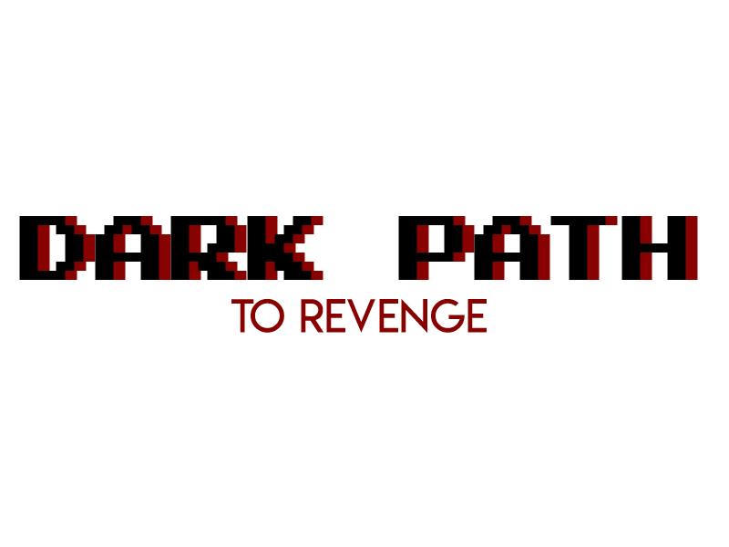

# Sumário
1. [Finalidade](#finalidade)
2. [Resumo](#resumo)
3. [Características](#caracteristicas)
4. [Plataformas](#plataformas)
5. [Engine](#engine)
6. [Equipe](#equipe)
7. [Lista de tarefas](#listadetarefas)
    1. [Jogador](#jogador)
    2. [Inimigos](#inimigos)
    3. [Level 01](#level01)
    4. [Interface](#interface)
3. [Observações gerais](#observacoes)

### Finalidade

Projeto de desenvolvimento de um jogo para à disciplina de Mêcanicas e Balanceamento de Jogos.

## Resumo

A jornada de um homem em busca de vingança!

## Características

- 2D
- Plataforma
- Ação/Terror

## Plataformas

- Windows
- Linux

## Engine

- Godot 3.0

## Equipe

- Airton Everton
- Alexandre Alyson
- Matthews Welisson

## Lista de tarefas

- Quando escolher um item coloque **\@username** depois dele para evitar mais de uma pessoa fazendo a mesma coisa.
- Quando completar o item colocar **\[x]** antes dele.
- Tente pegar só um item por vez e, quando finalizar, pegar o próximo. Não se sobrecarregue.:+1:
- Se não conseguir completar uma tarefa, coloque \*\*Ajuda\*\* depois dele e tente pegar outro item.
- Se pegar um item marcado com **Ajuda** coloque o seu **\@username** depois do **\@username** principal e ajude o coleguinha.

### Jogador

- [ ] Movimentação
- [ ] Pulo duplo
- [ ] Deslizar
- [ ] Usar escada
- [ ] Ataques com espada em solo
- [ ] Ataques com espada no ar
- [ ] Ataques à distância com magia
- [ ] Habilidade especial
- [ ] Coleta/Utilização de itens
- [ ] Morte

### Inimigos

- [ ] Patrulhamento
- [ ] Ataque
- [ ] Morte
- [ ] Itens
- [ ] Conjuração
- [ ] Transformação

### Level 01

- [ ] Esboço
- [ ] Quebra-cabeça
- [ ] Eventos
- [ ] Tileset
- [ ] Áudio
- [ ] \(Opcional) Efeitos especiais

### Interface

- [ ] Telas
- [ ] Menus
- [ ] \(Opcional) Inventário
- [ ] \(Opcional) Salvamento
- [ ] \(Opcional) Carregamento
- [ ] HUD não diegético

## Observações gerais

- Coloque aqui qualquer consideração que achar necessária.
